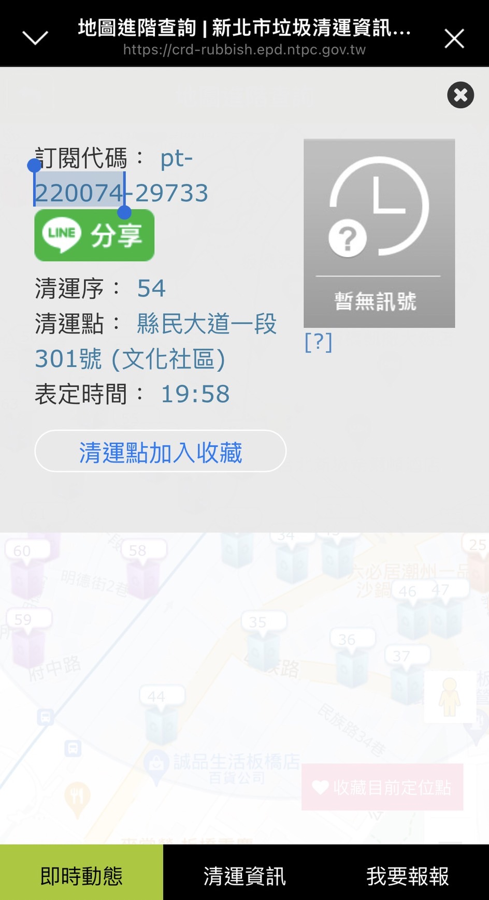

# :warning:注意

新北市政府提供之 Open Data 資料不齊全，若要所有垃圾車資料請從以下連結獲取

```
https://crd-rubbish.epd.ntpc.gov.tw/dispProject/api/line-status.ashx?lineid=XXXXXX
```

其中`XXXXXX`為路線 ID，可透過手機開啟[新北樂圾車網頁](https://crd-rubbish.epd.ntpc.gov.tw/dispPageBox/NtpcepdMB/NtpMCp.aspx?ddsPageID=MADVANCED)查詢，圖中選取部分即為該清運點之路線 ID


